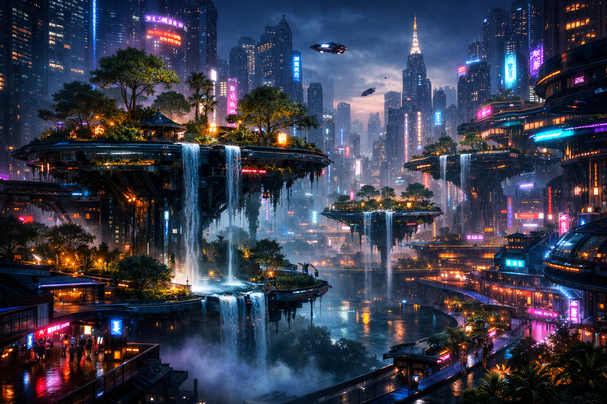
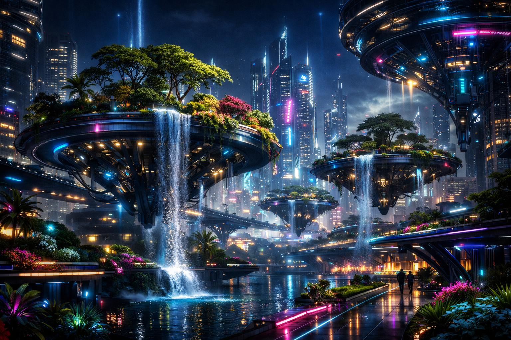

# Awesome AI Image Prompts ✨

🎉 ¡Bienvenido a la colección de prompts e imágenes generadas por IA! Este repositorio está inspirado en el formato de [awesome-nano-banana](https://github.com/JimmyLv/awesome-nano-banana) y busca mostrar las capacidades comparativas de diferentes modelos de IA.

## 📖 Directorio de Casos

A continuación se presenta una comparativa visual de las imágenes generadas utilizando el mismo prompt en dos modelos distintos.

### Caso 1: Ciudad Futurista con Jardines Flotantes

**Prompt:**
> "A futuristic city with floating gardens and neon lights, cinematic lighting, hyper-realistic, 8k resolution, cyberpunk aesthetic."

| Modelo A (Generación 1) | Modelo B (Generación 2) |
| :---: | :---: |
|  |  |

#### Detalles Técnicos
- **Estilo:** Cyberpunk / Futurista
- **Resolución:** 8K
- **Elementos clave:** Luces de neón, jardines flotantes, iluminación cinematográfica.

---

## 🛠️ Cómo contribuir
Si deseas añadir tus propios prompts y comparativas:
1. Haz un fork del repositorio.
2. Añade tus imágenes a la carpeta `images/`.
3. Actualiza este `README.md` siguiendo el formato de tabla.
4. ¡Envía un Pull Request!

## 🌟 Créditos
Inspirado por el proyecto [awesome-nano-banana](https://github.com/JimmyLv/awesome-nano-banana).
